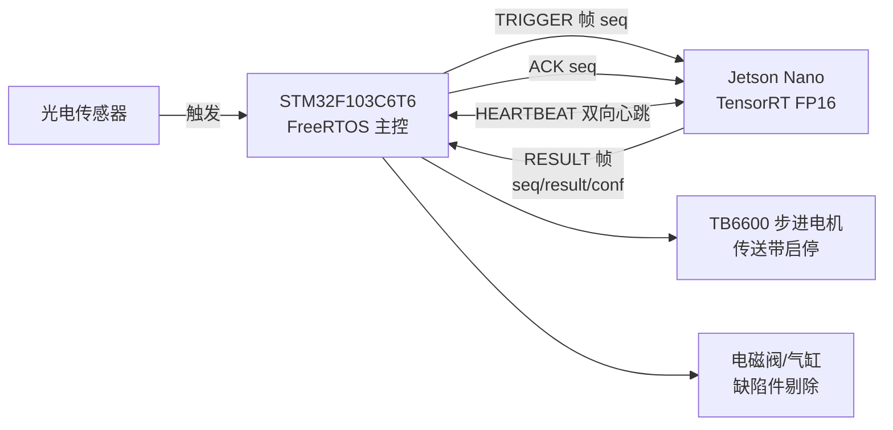

# 金属垫片视觉分拣系统

> 面向中低速五金产线的边缘视觉 + 实时分拣系统：**Jetson Nano** 部署 TensorRT FP16 模型识别金属垫片的缺口与变形，**STM32F103C6T6** 作为产线节拍与安全策略主控，双机经串口协作完成"光电触发—视觉判定—气缸剔除"闭环，全程失效安全设计。


---

## 系统架构



- **STM32 是主控**：负责产线节拍、通信事务与失效安全策略；视觉服务失联、相机无新帧、结果帧损坏或结果超时，均执行失效安全剔除，杜绝未检测工件静默放行。
- **Jetson 只负责视觉**：UVC 相机取帧、TensorRT FP16 推理、按事务序号缓存结果（重发触发帧直接回放，不重复推理）。

## 仓库结构

```text
.
├── .github/workflows/ci.yml      # GitHub Actions：交叉编译 + 资源预算门禁 + 协议单测
├── ci/check_firmware_size.py     # Flash/SRAM 预算门禁脚本
├── deploy/                       # systemd 单元与环境变量示例
├── docs/                         # 工程化说明、简历项目描述、论文大纲
├── inspection_protocol.py        # 双向 UART 协议纯 Python 实现（Jetson 与测试共用）
├── jetson_csi_infer.py           # Jetson Nano 推理服务（TensorRT / OpenCV / pyserial）
├── led2/                         # STM32 固件工程（CubeMX + CMake，含 FreeRTOS）
└── tests/                        # 协议单元测试（unittest）
```

## 技术要点

### STM32 固件（`led2/`）

- **3 个静态任务**：检测、通信、执行，优先级 执行 > 通信 > 检测，经 3 个二值信号量同步；任务、信号量与内核 Idle/Timer 任务全部静态分配，关闭动态堆。
- **可靠性**：IWDG 独立看门狗（LSI/256，约 1 s）+ 最高优先级 Monitor 任务监控三任务心跳；栈溢出 Hook；对象创建失败即停机。
- **双向心跳**：空闲每秒发送 `HEARTBEAT`；连续 3 s 无有效帧判定视觉失联，当前工件按失效安全立即剔除。
- **通信预算**：单次事务预算 185 ms，80 ms 未响应重发一次，满足 195 ms 端到端目标；PWM 按 ARR 自动计算 50% 占空比，杜绝 `Compare > ARR` 无脉冲问题。

### Jetson 推理服务（`jetson_csi_infer.py`）

- TensorRT 引擎启动预热，将 CUDA 首次分配移出在线时延路径。
- 独立相机线程持续清空 UVC 缓冲，仅保留最新帧（>200 ms 旧帧不参与判定）；连续读帧失败自动重开相机，无需重启服务。
- 8 位事务序号缓存最近结果：重复触发帧直接回放，收到 ACK 后删除。
- 缺陷/异常帧经有界队列由后台线程 JPEG 落盘（时间戳 + 序号 + 结果码命名），不占推理时延路径。
- 日志为 JSON Lines，记录序号、类别、置信度与服务时延。

### 双向 UART 协议

固定帧长 8 字节，`AA 55` 起始 + XOR 校验：

| 字段 | SOF1 | SOF2 | VER | TYPE | SEQ | CODE | AUX | XOR |
|---|---:|---:|---:|---:|---:|---:|---:|---:|
| 取值 | `AA` | `55` | `01` | 消息类型 | 事务序号 | 结果/参数 | 置信度 | `VER..AUX` 异或 |

消息类型：`0x10 TRIGGER`、`0x20 RESULT`、`0x30 ACK`、`0x40 HEARTBEAT`。
序号、超时重发、重复结果缓存与 ACK 共同保证事务幂等；心跳帧的 AUX 字段携带串口 RX 校验错误计数，用于在线链路质量观测。详细设计见 [`docs/工程化说明.md`](docs/工程化说明.md)。

## 构建与测试

### 固件（STM32）

```bash
cmake -S led2 -B led2/build -G Ninja \
  -DCMAKE_TOOLCHAIN_FILE=led2/cmake/gcc-arm-none-eabi.cmake \
  -DCMAKE_BUILD_TYPE=Release
cmake --build led2/build
```

生产与 CI 门禁均使用 **Release（-Os）** 配置。

### 协议单元测试

```bash
python3 -m unittest discover -s tests -v
```

### 资源占用（Release -Os）

| 资源 | 占用 | 比例 |
|---|---|---|
| Flash | 18,400 / 32,768 B | 56.15% |
| SRAM | 8,128 / 10,240 B | 79.38% |

## Jetson 部署

```bash
# 1. 将工程与 TensorRT engine 部署到 /opt/washer-inspection
sudo cp deploy/washer-inspection.env.example /etc/washer-inspection.env   # 按需修改
sudo cp deploy/washer-inspection.service /etc/systemd/system/
sudo systemctl daemon-reload
sudo systemctl enable --now washer-inspection
journalctl -u washer-inspection -f
```

配置项（`INSPECTION_ENGINE`、`INSPECTION_SERIAL`、`INSPECTION_CONFIDENCE` 等）见
[`deploy/washer-inspection.env.example`](deploy/washer-inspection.env.example)。
TensorRT / PyCUDA / OpenCV 由 JetPack 提供；串口依赖 `pyserial`。

## CI

推送与 PR 均触发 [GitHub Actions](.github/workflows/ci.yml)：

- **Firmware**：`gcc-arm-none-eabi` 交叉编译 Release 固件，`arm-none-eabi-size` 输出经
  `ci/check_firmware_size.py` 校验 Flash/SRAM 预算，超限即失败。
- **Python**：全部 Python 文件语法检查 + 协议单元测试。

## 已知限制

- 仓库不含垫片数据集、训练权重与 TensorRT engine，无法从当前代码推导检测准确率；
  上线前需按 `docs/工程化说明.md` 第 4 节完成精度、时延与失效注入验证。
- "≤195 ms" 指光电触发到 STM32 形成决策（不含 120 ms 气缸保持时间），引用时建议附样本量与 P95/P99 统计。

## 许可证

[MIT](LICENSE)
